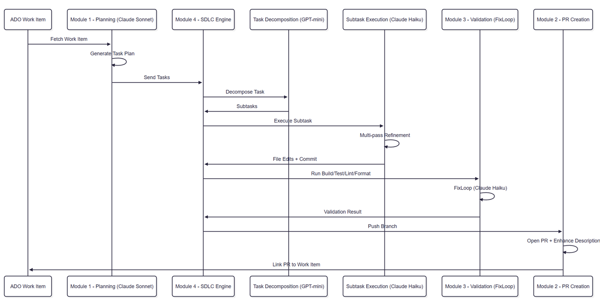

# 5. Architecture Overview

The orchestrator is built as a **modular, deterministic, repo‑agnostic SDLC engine**. It combines:

*   Azure DevOps MCP
*   GitHub MCP
*   Multi‑model AI (Claude + OpenAI)
*   Clean Architecture enforcement  
*   A temp‑workspace execution model
*   A self‑healing FixLoop
*   A multi‑phase SDLC pipeline
    
This page describes the full architecture.

## 5.1 Multi‑Agent SDLC Flow (Claude + OpenAI)

```
User CLI
  python main.py <work_item_id>
        |
        v
Orchestrator (main.py)
        |
        v
+---------------------------+
|  Planning Agent           |
|  Model: Claude Sonnet     |
|  File: work_item_planning |
+---------------------------+
        |
        v
+---------------------------+
|  Decomposition Agent      |
|  Model: GPT‑5.4‑mini      |
|  File: task_decomposer    |
+---------------------------+
        |
        v
+---------------------------+
|  Execution Agent          |
|  Model: Claude Haiku      |
|  File: task_executor      |
+---------------------------+
        |
        v
+---------------------------+
|  Build/Test Validator     |
|  Tools: dotnet / npm      |
|  File: validator          |
+---------------------------+
        |
   if failure
        v
+---------------------------+
|  FixLoop Agent            |
|  Model: Claude Haiku      |
|  File: fix_loop           |
+---------------------------+
        |
        v
+---------------------------+
|  Git + PR Automation      |
|  GitHub MCP / GitWorkflow |
+---------------------------+
        |
        v
ADO Work Item linked to PR
```

## 5.2 Module Overview

### Module 1 — Work Item Planning

*   Reads Work Item    
*   Validates quality    
*   Reuses an existing plan if the Work Item already has child tasks (idempotent)
*   Generates plan (only if none exists yet)
*   Creates child tasks    
*   Adds comments    
*   Updates Work Item state    

### Module 2 — AI Developer Loop (GPT‑mini + Claude Haiku)

*   Creates feature branch    
*   Decomposes tasks (default: GPT‑mini)
*   Generates code edits (default: Claude Haiku)
*   Applies edits safely    
*   Commits per subtask    
*   Enhances PR    
*   Links PR to Work Item    

### Module 3 — Validation + FixLoop

*   Build    
*   Test    
*   Lint    
*   Format    
*   Auto‑fix    
*   Retry    
*   Only push if green    
*   Backend, frontend, and fullstack repos all supported

### Module 4 — Multi‑Phase SDLC Loop

*   Task decomposition    
*   Sub‑task execution    
*   Multi‑pass refinement    
*   Task memory    
*   PR enhancement    

## 5.3 Temp Workspace Architecture

All code generation, builds, tests, and fixes happen inside:

    <repo>/.orchestrator-tmp/

This ensures:
*   Your real repo is never corrupted    
*   FixLoop cannot break your working tree    
*   All changes are validated before PR creation    

## 5.3.1 Persisted Run State (Resume From a Crash)

Unlike `.orchestrator-tmp/` — which is wiped and recreated at the start of every run — progress is also persisted outside the target repo entirely, so it survives a crash:

    <orchestrator-dir>/.orchestrator-state/<repo-key>-<work_item_id>.json

This tracks the branch name, the task plan, each task's subtask breakdown, per-subtask completion, validation status, and the PR URL once opened. Re-running the same command after a crash automatically detects this file, checks out the existing branch, and resumes from the first unfinished subtask instead of starting over. See [Resume From a Crash](./14-resume-from-crash.md) for the full picture.

## 5.4 FixLoop Architecture

FixLoop is a **self‑healing engine**:

    Error → FixLoop → Edits → Apply → Rebuild → Retest → Repeat
    
It includes:
*   Clean Architecture enforcement    
*   Safe path validation    
*   Minimal diff philosophy    
*   No destructive edits    
*   No JSON corruption    
*   No hallucinated folders    
*   No csproj rewrites unless required    

## 5.5 Clean Architecture Enforcement

The orchestrator enforces:
*   No new modules    
*   No moving files across modules    
*   Only allowed folders inside modules    
*   Strict naming conventions    
*   Path validation before applying edits
    
This prevents AI from “inventing” architecture.

## 5.6 File Structure (Final)

    orchestrator/
      main.py
      validator.py
      fix_loop.py
      file_editing.py
      prompt_builder.py
      repo_type.py
      preflight_validator.py
      run_state.py
    
      # Work Item Planning
      work_item_planning.py
    
      # GitHub + Git + ADO MCP clients
      mcp_servers/
        ado_mcp_client.py
        github_mcp_client.py
      git_workflow.py
      pr_enhancer.py
    
      # Task Execution
      task_decomposer.py
      task_executor.py
      task_memory.py
    
      # Backend
      backend_build.py
      backend_test.py
    
      # Frontend
      frontend_build.py
      frontend_test.py
      frontend_lint.py
      frontend_format.py
    
      # Architecture Enforcement
      architecture/
        enforcement.py
    
      # Utilities
      utils/
        path_normalization.py
        path_unifier.py
        json_extractor.py
        json_sanitizer.py
        json_validator.py
        repo_scanner.py
        tree_visualiser.py
        copy_repo.py
    
      # Tests
      tests/
        conftest.py
        test_*.py
    
      pytest.ini
      requirements-dev.txt
    
      # Runtime-only, not checked in
      .orchestrator-state/   (persisted run state, see 5.3.1)
    
## 5.7 End‑to‑End Flow Diagram

```
Work Item → Plan → Tasks → Branch → Sub‑Tasks → Edits → Commit → Build → Test → FixLoop → Push → PR → Link → Done
```

## 5.8 Multi‑Agent SDLC Sequence Diagram



[<< Overview](../../README.md)
 | 
[<< Module 4: Multi‑Task, Multi‑Phase, Multi‑Commit SDLC Loop](./5-module-4.md)
 | 
[FixLoop Deep Dive >>](./7-fixloop-deep-dive.md)
